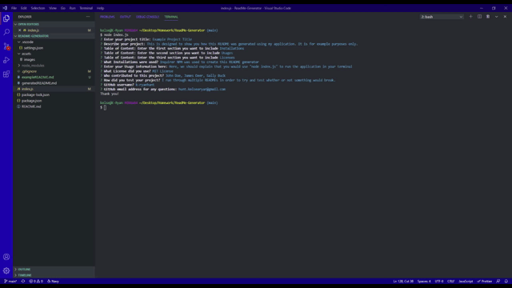
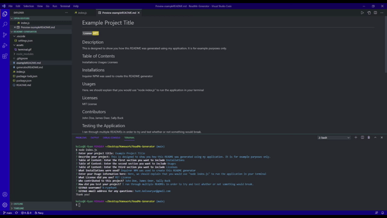

# ReadMe-Generator

## Description

This project we were tasked with creating a generator that will automatically create your README for you.  It will go through multiple questions gathering data and then will create a professional README with your input plugged in.  For my generator, I gave the user an option for 3 items that they will put in their Table of Content.

## Table of Contents

1. Installations
2. Usages
3. Licenses
4. Contributors

## Installations

* Inquirer NPM

You must install 'inquirer NPM' in order to have this function properly.

## Usages

* Node.js

This application is ran by opening your terminal and running 'node index.js'

It should prompt through the questions and when you are finished, create a README called README2 so it doesn't override the current README describing this project.

## Licenses

## Contributors

Kelsea Hunt

## Screenshots of Application

